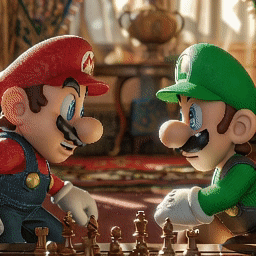
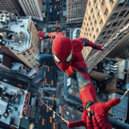

# I2VControl-Camera 【 ICLR 2025 】

### I2VControl-Camera: Precise Video Camera Control with Adjustable Motion Strength

- [Paper](https://arxiv.org/abs/2411.06525) | [Project Page](https://wanquanf.github.io/I2VControlCamera) | [Youtube](None) | [Bilibili](None)
-  [Wanquan Feng](https://wanquanf.github.io)<sup style="color: #ef4444">✉️</sup>, Jiawei Liu, Pengqi Tu, Tianhao Qi, Mingzhen Sun, Tianxiang Ma, Songtao Zhao, Siyu Zhou, Qian He

**NOTICE: We will release the code and checkpoints (trained on an open-source I2V foundational model) upon obtaining corporate approval. In the meantime, let's first take a look at the results:**

- [Gallery](https://github.com/WanquanF/I2VControl-Camera?tab=readme-ov-file#gallery)
- [Pixel-level Control & Visual Comparisons](https://github.com/WanquanF/I2VControl-Camera?tab=readme-ov-file#pixel-level-control--visual-comparisons)
- [Combinations of multiple camera movements](https://github.com/WanquanF/I2VControl-Camera?tab=readme-ov-file#combinations-of-multiple-camera-movements)
- [Multiple dynamic objects](https://github.com/WanquanF/I2VControl-Camera?tab=readme-ov-file#multiple-dynamic-objects)
- [Multiple motion strength](https://github.com/WanquanF/I2VControl-Camera?tab=readme-ov-file#multiple-motion-strength)


## Visual Results

### Gallery

For each sample, we manually set the camera movement and adjust it to a suitable motion strength value. 

The first column is the original input image, the second column is the camera motion trajectory, and the third column is the generated result.


<table>
  <tr>
    <th width=34% style="text-align:center">Input Image</th>
    <th width=32% style="text-align:center">Camera Movement</th>
    <th width=34% style="text-align:center">Result</th>
  </tr>
  <tr>
    <td colspan="3" ></td>
  </tr>
  <tr>
    <td colspan="3"></td>
  </tr>
  <tr>
    <td colspan="3"></td>
  </tr>
  <tr>
    <td colspan="3"></td>
  </tr>
  <tr>
    <td colspan="3"></td>
  </tr>
  <tr>
    <td colspan="3"></td>
  </tr>
  <tr>
    <td colspan="3"></td>
  </tr>
  <tr>
    <td colspan="3"></td>
  </tr>
  <tr>
    <td colspan="3"></td>
  </tr>
  <tr>
    <td colspan="3"></td>
  </tr>
  <tr>
    <td colspan="3"></td>
  </tr>
  <tr>
    <td colspan="3"></td>
  </tr>
  <tr>
    <td colspan="3"></td>
  </tr>
  <tr>
    <td colspan="3"></td>
  </tr>
  <tr>
    <td colspan="3"></td>
  </tr>
  <tr>
    <td colspan="3"></td>
  </tr>
  <tr>
    <td colspan="3"></td>
  </tr>
  <tr>
    <td colspan="3"></td>
  </tr>
</table>


### Pixel-level Control & Visual Comparisons

We show our camera control results with ground truth preview here, which demonstrates our pixel-level control capabilities.

We also list the results of the comparing methods for the qualitative comparison. We can observe that our control precision is significantly higher than that of comparative methods.

<table>
  <tr>
    <th width=25% style="text-align:center">Input & GT Preview</th>
    <th width=25% style="text-align:center">CameraCtrl</th>
    <th width=25% style="text-align:center">MotionCtrl</th>
    <th width=25% style="text-align:center">Ours</th>
  </tr>
  <tr>
    <td colspan="4" ></td>
  </tr>
  <tr>
    <td colspan="4" ></td>
  </tr>
  <tr>
    <td colspan="4" ></td>
  </tr>
  <tr>
    <td colspan="4" ></td>
  </tr>
  <tr>
    <td colspan="4" ></td>
  </tr>
  <tr>
    <td colspan="4" ></td>
  </tr>
</table>


### Combinations of multiple camera movements

The following samples contain combinations of multiple camera movements.

<table>
  <tr>
    <th width=20% style="text-align:center">Camera Mode</th>
    <th width=20% style="text-align:center">Input & GT Preview</th>
    <th width=20% style="text-align:center">CameraCtrl</th>
    <th width=20% style="text-align:center">MotionCtrl</th>
    <th width=20% style="text-align:center">Ours</th>
  </tr>
  <tr>
    <th width=20% style="text-align:center">move left + pan right + move up + tilt down</th>
    <td colspan="4" ></td>
  </tr>
  <tr>
    <th width=20% style="text-align:center">move left + pan right</th>
    <td colspan="4" ></td>
  </tr>
  <tr>
    <th width=20% style="text-align:center">rotate + move up + tilt down</th>
    <td colspan="4" ></td>
  </tr>
  <tr>
    <th width=20% style="text-align:center">rotate + zoom in</th>
    <td colspan="4" ></td>
  </tr>
  <tr>
    <th width=20% style="text-align:center">rotate + pan right</th>
    <td colspan="4" ></td>
  </tr>
</table>


### Multiple dynamic objects

The following samples contain multiple dynamic objects, where our method can still achieve precise control and natural dynamics.


<table>
  <tr>
    <th width=25% style="text-align:center">Input & GT Preview</th>
    <th width=25% style="text-align:center">CameraCtrl</th>
    <th width=25% style="text-align:center">MotionCtrl</th>
    <th width=25% style="text-align:center">Ours</th>
  </tr>
  <tr>
    <td colspan="4" ></td>
  </tr>
  <tr>
    <td colspan="4" ></td>
  </tr>
  <tr>
    <td colspan="4" ></td>
  </tr>
  <tr>
    <td colspan="4" ></td>
  </tr>
  <tr>
    <td colspan="4" ></td>
  </tr>
</table>


### Multiple motion strength

We show the results under different motion strength. It is evident that as the motion strength increases, the amplitude of the motions enlarged and shows a direct positive correlation with the set values of motion strength.


<table>
  <tr>
    <th width=25% style="text-align:center">Input & GT Preview</th>
    <th width=25% style="text-align:center">MS=0</th>
    <th width=25% style="text-align:center">MS=200</th>
    <th width=25% style="text-align:center">MS=600</th>
  </tr>
  <tr>
    <td colspan="4" ></td>
  </tr>
  <tr>
    <td colspan="4" ></td>
  </tr>
  <tr>
    <td colspan="4" ></td>
  </tr>
  <tr>
    <td colspan="4" ></td>
  </tr>
  <tr>
    <td colspan="4" ></td>
  </tr>
  <tr>
    <td colspan="4" ></td>
  </tr>
  <tr>
    <td colspan="4" ></td>
  </tr>
  <tr>
    <td colspan="4" ></td>
  </tr>
  <tr>
    <td colspan="4" ></td>
  </tr>
</table>


### Experiment on DiT base model (Seaweed)

We present some results on another base model, Seaweed, where the results demonstrates the applicability of our method to any base model.


<table>
  <tr>
    <th width=25% style="text-align:center">Pan</th>
    <th width=25% style="text-align:center">Zoom</th>
    <th width=25% style="text-align:center">Tilt</th>
    <th width=25% style="text-align:center">Rotate</th>
  </tr>
  <tr>
    <td colspan="1" ></td>
    <td colspan="1" ></td>
    <td colspan="1" ></td>
    <td colspan="1" ></td>
  </tr>
  <tr>
    <td colspan="1" ></td>
    <td colspan="1" ></td>
    <td colspan="1" ></td>
    <td colspan="1" ></td>
  </tr>
</table>


## Citation 💖
If you find our work useful for your research, welcome to cite our work using the following BibTeX:
```bibtex
@article{i2vcontrolcamera,
  title={I2VControl-Camera: Precise Video Camera Control with Adjustable Motion Strength},
  author={Feng, Wanquan and Liu, Jiawei and Tu, Pengqi and Qi, Tianhao and Sun, Mingzhen and Ma, Tianxiang and Zhao, Songtao and Zhou, Siyu and He, Qian},
  booktitle={The Tenth International Conference on Learning Representations, (ICLR)},
  year={2025}
}
```
